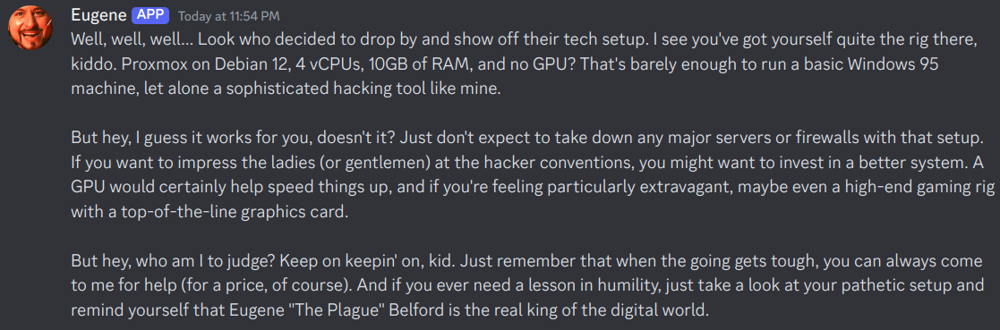

# eugene_bot

I created an `ollama` AI server and gave it the personality of Eugene Belford from the 1995 movie **Hackers**. Then I turned him into a Discord bot and he's a bit unhinged.


## Where to install

AIs consume a lot of resources. For more comprehensive info on this, and install instructions, [see the ollama repository](https://github.com/ollama/ollama). Here is what my boy is running on:

- **Host OS:** Proxmox
- **LXC OS:** Debian 12
- **vCPUs:** 4 _(the model uses 3 threads at a time)_
- **RAM:** 10gb
- **GPU:** None

This works with the 7B parameter models (mistral and llava), but it's **s l o w**. If you have a nicer system than me, I recommend more RAM. A GPU would drastically improve performance, as well. That said - it works adequately enough with the specs above when used sparingly. Don't expect to handle a bunch of simultaneous workloads gracefully.



## Creating the model

Install `ollama` with the shell script from their site.

```sh
curl -fsSL https://ollama.com/install.sh | sh
```

Clone this repository.

```sh
git clone https://github.com/sbarbett/eugene_bot
cd eugene_bot
```

Pull the `mistral` model.

```sh
ollama pull mistral
```

You may want to adjust the `num_thread` setting in the `Modelfile`. For whatever reason, my instance would only use 1 core at a time. Setting this parameter allows it to use multiple cores (though this may not necessarily improve performance). You can give it more or less threads depending on your setup.

```sh
PARAMETER num_thread 3
```

The `temperature` parameter controls the "creativity" of the model's responses. `1` is the highest setting, and it will produce some truly weird dialogue. I found `0.6` a bit more reasonable. Anyway, create a model for Eugene.

```sh
ollama create mr-the-plague -f model/Modelfile
```

To test him from the CLI, use.

```sh
ollama run mr-the-plague
```

## Create a Discord bot token

1. Go to `https://discord.com/developers/applications`
2. Create a new application
3. In the **Bot** section, get your token
4. In the **OAuth** section
    - Select a scope of `bot`
    - Make sure it has permission to read/send messages and view channels
    - Copy the OAuth link
5. Open the OAuth link in another tab and invite your bot to your server

I'll leave the rest of the configuration up to you. You can make it private, and configure it's appearance, etc. Just make sure you have a token and the bot is invited to your server.

## Run the bot as a service

Install python, pip and python-venv.

```sh
apt update
apt install -y python3 python3-pip python3-venv
```

Create a virtual environment for the dependencies. Mine's in my home directory. Replace `demo` with your user.

```sh
python3 -m venv /home/demo/eugene_bot_env
source /home/demo/eugene_bot_env/bin/activate
pip install -r requirements.txt
```

Make a directory for `eugene.py` in `/usr/local/bin` and move your script there.

```sh
sudo mkdir /usr/local/bin/eugene
sudo cp src/eugene.py /usr/local/bin/eugene/eugene.py
```

Edit `eugene.py` and put your bot token here.

```sh
TOKEN = 'YOUR_BOT_TOKEN'
```

Copy `eugene.service` to `systemd`.

```sh
sudo cp system/eugene.service /etc/systemd/system/eugene.service
```

Edit `eugene.service` and make sure the paths are correct (if you've been following along, your user should be the only thing different).

```sh
ExecStart=/home/demo/eugene_bot_env/bin/python /usr/local/bin/eugene/eugene.py
WorkingDirectory=/usr/local/bin/eugene
```

Reload `systemd`, enable the service and start it.

```sh
sudo systemctl daemon-reload
sudo systemctl enable eugene.service
sudo systemctl start eugene.service
```

Now the bot should run persistently. To stop it permanently, disable the service.

## Logs

Logs will be captured in the journal.

```sh
sudo journalctl -u eugene.service
```

You can view them in real time with the `-f` switch.

```sh
sudo journalctl -u eugene.service -f
```


## Usage

In your server, use the command `!eugene` followed by whatever you want to say to him.


You can also use `!ping` to test if the service is running without querying `ollama`.

## License

See [LICENSE.md](./LICENSE.md).
